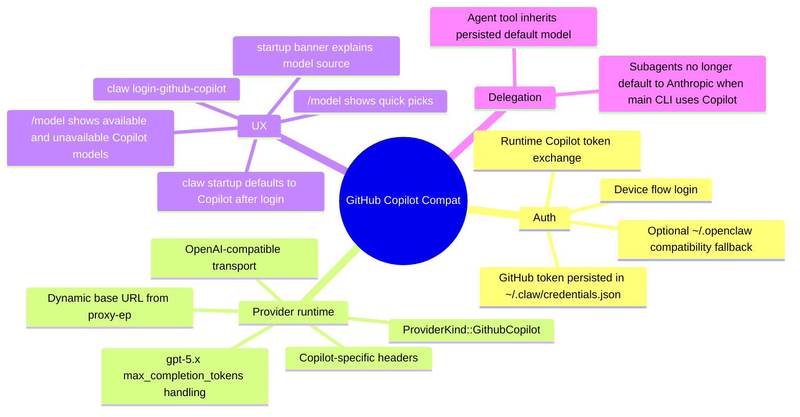
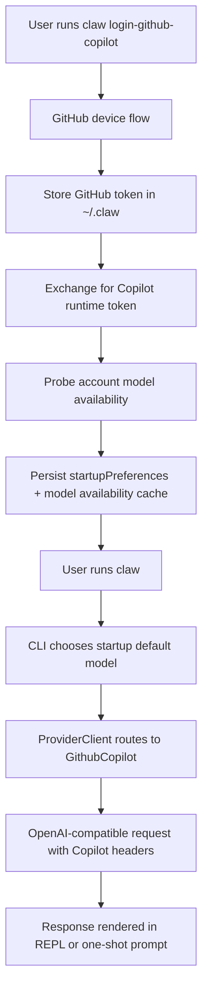

# GitHub Copilot Compatibility

This document explains the GitHub Copilot compatibility layer added to the Rust CLI, how it fits into the current architecture, what was changed, and what was validated.

## Outcome

The Rust CLI now supports GitHub Copilot as a first-class provider without replacing the existing Anthropic/xAI/OpenAI paths.

For a normal user, the intended flow is:

1. Run `claw login-github-copilot`
2. Approve the GitHub device flow once
3. Launch `claw`
4. Start chatting on the Copilot-backed default model automatically

The system also:

- detects which Copilot models the current account can actually use
- shows that information in the UX
- keeps explicit `--model` and `/model` overrides working
- makes subagents inherit the active default model instead of falling back to Anthropic

## System Map

## Architecture

### 1. Auth and credential storage

Files involved:

- [crates/api/src/providers/github_copilot.rs](/Users/cosmophonix/claudecoderust/theanomaly/rust/crates/api/src/providers/github_copilot.rs)
- [crates/runtime/src/oauth.rs](/Users/cosmophonix/claudecoderust/theanomaly/rust/crates/runtime/src/oauth.rs)

Implemented pieces:

- GitHub device-flow login using GitHub's device endpoints
- GitHub token persistence under `~/.claw/credentials.json`
- runtime Copilot token exchange via `https://api.github.com/copilot_internal/v2/token`
- runtime token caching with expiry buffer
- optional fallback to `~/.openclaw` state when present on the local machine

Credential store keys introduced:

- `githubCopilot`
- `githubCopilotRuntime`
- `githubCopilotModelAvailability`
- `startupPreferences`

### 2. Provider routing

Files involved:

- [crates/api/src/providers/mod.rs](/Users/cosmophonix/claudecoderust/theanomaly/rust/crates/api/src/providers/mod.rs)
- [crates/api/src/client.rs](/Users/cosmophonix/claudecoderust/theanomaly/rust/crates/api/src/client.rs)
- [crates/api/src/providers/openai_compat.rs](/Users/cosmophonix/claudecoderust/theanomaly/rust/crates/api/src/providers/openai_compat.rs)

Implemented pieces:

- added `ProviderKind::GithubCopilot`
- accepted `github-copilot/<model-id>` refs
- normalized Copilot requests onto the OpenAI-compatible client path
- stripped the `github-copilot/` prefix before sending the request upstream
- applied Copilot-specific headers
- switched `gpt-5.x` requests to `max_completion_tokens`

### 3. User-facing CLI and TUI

Primary file:

- [crates/claw-cli/src/main.rs](/Users/cosmophonix/claudecoderust/theanomaly/rust/crates/claw-cli/src/main.rs)

Implemented pieces:

- `claw login-github-copilot`
- `claw logout-github-copilot`
- `copilot` alias for `github-copilot/gpt-5.4`
- `copilot-4o` alias for `github-copilot/gpt-4o`
- persisted startup default after successful Copilot login
- startup banner now shows when GitHub Copilot was selected as the login default
- `/model` now shows:
  - current model
  - quick picks
  - detected available Copilot models
  - detected unavailable Copilot models

### 4. Subagents

Primary file:

- [crates/tools/src/lib.rs](/Users/cosmophonix/claudecoderust/theanomaly/rust/crates/tools/src/lib.rs)

Implemented pieces:

- the `Agent` tool now inherits `startupPreferences.default_model` when no explicit subagent model is passed
- this keeps delegated work on the same provider path as the main CLI

## Flow Map

## What was tested

### Core compatibility

- `cargo test -p api -p claw-cli -p tools`
- `./target/debug/claw --model github-copilot/gpt-4o --output-format text prompt "reply with exactly: ok"`
- `./target/debug/claw --model github-copilot/gpt-5.4 --output-format text prompt "reply with exactly: ok"`

### Startup default UX

- `./target/debug/claw login-github-copilot`
- `./target/debug/claw`
- `./target/debug/claw --output-format text prompt "reply with exactly: startup-default-ok"`

### Model availability detection on the current account

Detected available:

- `github-copilot/claude-sonnet-4.6`
- `github-copilot/claude-sonnet-4.5`
- `github-copilot/gpt-4o`
- `github-copilot/gpt-4.1`
- `github-copilot/gpt-5.4`

Detected unavailable:

- `github-copilot/gpt-4.1-mini`
- `github-copilot/gpt-4.1-nano`
- `github-copilot/o1`
- `github-copilot/o1-mini`
- `github-copilot/o3-mini`

### Subagent inheritance

- unit test verifies Agent tool inherits startup default model
- real smoke check verified newly spawned agent manifests now use `github-copilot/gpt-5.4` instead of `opus`

## Operational note

Background subagents created from a short-lived one-shot CLI invocation can outlive the parent process only if the parent process remains alive long enough to supervise them. The intended user path for interactive delegated work remains the REPL/TUI session.

That note is separate from provider inheritance:

- the provider mismatch bug is fixed
- subagents now inherit the Copilot-backed default model correctly

## What was intentionally not changed

- the original `claw login` flow
- existing Anthropic/xAI/OpenAI behavior
- explicit `--model` overrides
- `/model` session overrides
- the overall config architecture

## Summary for reviewers

This change set adds GitHub Copilot as a natural, additive provider layer rather than a forked runtime path.

The key design choices were:

- use native `~/.claw` storage first
- keep `~/.openclaw` fallback optional
- reuse the existing provider and OpenAI-compatible machinery where possible
- expose real account availability to the user
- keep delegation aligned with the same default model the main CLI is using
