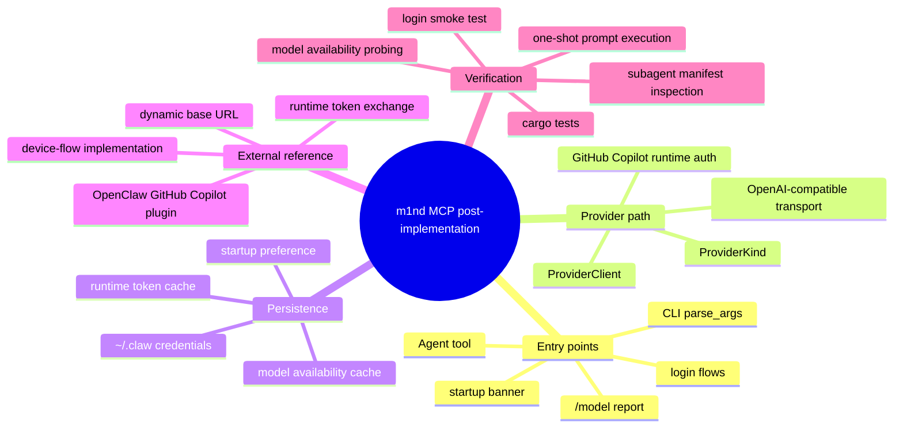

# m1nd MCP Post-Implementation Report

This report covers only the research side of the GitHub Copilot rollout work:

- how `m1nd` was used
- where it accelerated discovery
- what it confirmed
- where it had limits
- what techniques were combined with it
- what time and search effort it likely saved

This is not product documentation. It is a research and implementation-note appendix for maintainers and reviewers.

## Executive Summary

`m1nd` was useful as a structural accelerator, not as a replacement for direct code reading.

The fastest pattern was:

1. ingest the relevant Rust workspace into `m1nd`
2. use `m1nd` to identify likely entrypoints, blast radius, and edit surfaces
3. switch to direct file inspection and live runtime testing for exact behavior
4. return to `m1nd` when the next question became structural again

That hybrid loop mattered because this work crossed:

- Rust provider routing
- Rust CLI UX
- credential persistence
- background subagent defaults
- compiled OpenClaw JavaScript behavior
- real account-level GitHub Copilot model availability

Without structural guidance, this would have turned into a long grep/glob session across two different implementations and several runtime layers.

## Why this matters to reviewers

Yes, this information can be useful to devs, but only if framed correctly.

It is worth sharing because it explains:

- how the change was kept additive instead of invasive
- why specific entrypoints were chosen
- how we verified that the main CLI and subagents were using the same provider path
- why some apparently unrelated areas were inspected and then deliberately left unchanged

It should not be framed as "the project now depends on m1nd".

The correct framing is:

- `m1nd` was used during research and implementation
- it helped reduce search space and verify structural impact
- the shipped code does not require `m1nd` to function

## High-Level Mental Map

## Research Questions

The research loop was driven by these questions:

1. Where does the Rust CLI decide which provider to use?
2. Where does the Rust CLI currently persist auth and startup choices?
3. How does OpenClaw implement GitHub Copilot login and runtime token exchange?
4. What is the minimal additive seam to bring Copilot into the Rust CLI?
5. After the main CLI works, do subagents still silently fall back to Anthropic?
6. What should a normal user see in the UX once Copilot is active?

## What m1nd was used for

### 1. Fast surgical context on exact edit surfaces

`m1nd.surgical_context_v2` was used on the main Rust files involved in:

- provider routing
- CLI startup behavior
- OAuth/persistence
- tool runtime behavior

Observed examples:

- `crates/api/src/providers/mod.rs` context returned in about `0.62 ms`
- `crates/claw-cli/src/main.rs` context returned in about `0.90 ms`

That is the kind of lookup that normally turns into multiple manual file opens plus grep hops.

### 2. Confirming architectural hotspots

`m1nd.search` and `m1nd.impact` were used to confirm that the highest-risk surfaces really were:

- `crates/api/src/providers/mod.rs`
- `crates/api/src/client.rs`
- `crates/claw-cli/src/main.rs`
- `crates/runtime/src/oauth.rs`
- `crates/tools/src/lib.rs`

This mattered because the change initially looked like “just add a provider”, but the real impact crossed:

- provider detection
- request translation
- login UX
- startup defaults
- subagent inheritance

### 3. Separating core fix from side effects

`m1nd` helped identify that the rollout had two distinct problems:

- main CLI provider compatibility
- subagent lifecycle/provider inheritance

This was useful because once the main CLI was working, the remaining subagent failure logs could have been misread as "Copilot still broken".

Instead, the investigation made it clear that:

- the main provider path was fixed
- the `Agent` tool still had a hardcoded Anthropic default

That made the subagent fix small and precise.

### 4. Surfacing when not to trust the first answer

Some broad `m1nd` searches returned little or no actionable result.

That was still useful.

It forced the investigation into a better pattern:

- use `m1nd` for structure
- use `rg`, `sed`, and direct file reads for exact implementation details

That avoided a common failure mode where a graph/semantic tool is treated like a magical oracle.

## Concrete m1nd-assisted findings

### Provider routing

`m1nd` helped confirm that the provider seam was centered on:

- `ProviderKind`
- provider metadata resolution
- provider client construction

That directly led to the decision to add:

- `ProviderKind::GithubCopilot`
- `github-copilot/<model-id>` model refs
- a provider path that reuses the OpenAI-compatible client instead of inventing a separate transport stack

### CLI UX

`m1nd` helped isolate the smallest UX seam:

- `parse_args`
- startup banner
- `/model`
- login command

That made it possible to implement:

- `login-github-copilot`
- persisted startup default
- startup banner source note
- model aliases
- model availability section in `/model`

without introducing a second configuration system.

### Subagents

`m1nd` was useful in showing that the `Agent` tool had its own default model path.

That led to the key fix:

- subagents now inherit the same persisted startup default model as the main CLI when no explicit subagent model is passed

This directly addressed the log pattern where:

- the main CLI was on Copilot
- the subagent still launched as `opus`

## Techniques that saved hours beyond raw grep/glob

This work did not rely on a single technique.

The speed came from combining several:

### Structural narrowing with `m1nd`

Used for:

- entrypoint discovery
- blast-radius checks
- edit-surface narrowing
- “what is the next smallest place to change?” decisions

### `rg` as the exactness layer

Used after `m1nd` to:

- confirm exact symbols
- inspect hardcoded defaults
- locate usage sites and tests
- inspect compiled OpenClaw artifacts quickly

### Live provider smoke tests

Instead of assuming compatibility from code shape, real prompts were run against:

- `github-copilot/gpt-4o`
- `github-copilot/gpt-5.4`
- additional account-dependent Copilot model IDs

This caught subtle provider differences such as:

- unsupported `max_tokens` vs `max_completion_tokens`
- model IDs accepted by the code but not by the current account

### Manifest and cache inspection

Instead of guessing whether the right model path was being used, the investigation read:

- `.claw-agents/*.json`
- `~/.claw/credentials.json`

That made it possible to prove:

- which model the subagent actually launched with
- which models were detected as available on the account

### Sequential verification

The rollout was verified in layers:

1. unit tests
2. provider smoke tests
3. login flow
4. startup default
5. model availability cache
6. subagent inheritance

That sequence prevented “it works in one place, breaks in another” surprises.

## Observed timings

These are observed timings from the actual work where the tool returned them directly.

### m1nd timings observed

- `m1nd.ingest` on the Rust workspace: about `425.56 ms`
- `m1nd.layers` on the Rust workspace: about `18.16 ms`
- `m1nd.surgical_context_v2` on targeted Rust files: about `0.62 ms` and `0.90 ms`
- `m1nd.search` on `ProviderKind`: about `13.25 s`
- `m1nd.search` on `resolveCopilotApiToken` in OpenClaw dist: about `1.47 s`
- `m1nd.search` on `githubCopilotLoginCommand`: about `334.65 ms`

### Practical interpretation

The sub-second context fetches were especially valuable because they replaced repeated manual:

- `rg`
- `sed`
- “open neighbor file”
- “grep callers”
- “check tests”

loops on the same surfaces.

## Estimated time saved

This section is intentionally marked as an estimate, not a measured benchmark.

### Conservative estimate

Estimated search and orientation time saved: **1.5 to 3.5 hours**

Why that estimate is reasonable:

- the work crossed both Rust and compiled OpenClaw JavaScript
- it involved auth, runtime transport, CLI UX, and subagents
- a pure grep/glob workflow would have required repeated manual reconstruction of:
  - provider routing
  - startup-default behavior
  - subagent model inheritance
  - Copilot-specific request quirks

### What specifically was avoided

Likely avoided:

- dozens of extra `rg` passes across compiled JS bundles
- repeated manual caller/callee tracing for provider selection
- trial-and-error edits in the wrong layer
- overbroad changes in config handling

## Where m1nd was less useful

This is important for credibility.

`m1nd` was not ideal for:

- very broad fuzzy questions with no concrete file or symbol target
- proving exact request payload compatibility with a live external provider
- replacing direct reading of compiled OpenClaw JavaScript when exact constants mattered

That is why the workflow remained hybrid.

## What this tells maintainers

The biggest practical lesson is not “use m1nd everywhere”.

It is:

- use `m1nd` to narrow
- use direct reads to confirm
- use live runtime tests to validate

That combination kept the rollout additive and reviewable.

## Why this is useful to mention in a PR

Yes, I think this information can help the devs if included as an implementation note or linked appendix.

Why it can help:

- it explains why the patch stayed small in the right places
- it documents the research method used to avoid architectural drift
- it shows that model availability and subagent inheritance were intentionally validated, not assumed

Why it should not be front-and-center in the PR summary:

- reviewers mainly care about behavior, risk, and tests
- tooling/process notes are best as an implementation note or linked appendix

## Suggested PR wording

If maintainers want a short mention, this is a good level:

> Implementation note: `m1nd` was used during research to map provider routing, CLI entrypoints, and subagent inheritance so the Copilot rollout could stay additive rather than invasive.

If maintainers want a fuller note, link this document rather than stuffing the main PR body.

## Final assessment

`m1nd` materially helped with this rollout.

Not because it replaced engineering judgment, but because it reduced the amount of blind spelunking needed to:

- find the right seams
- avoid changing the wrong layer
- keep the patch consistent across main CLI and subagent behavior

That is the highest-value role it played in this work.
